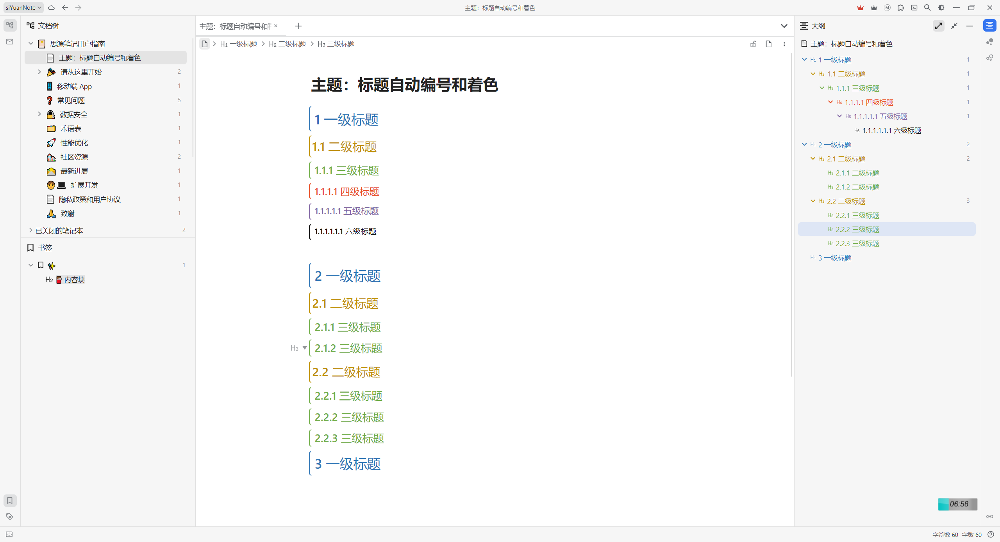

# 简介
在官方样式的基础上，对标题和大纲进行颜色渲染和自动编号。

原因：Dark+ 的编号样式挺符合我的预期的，但是有两个缺点：
- 主题的内容太多，在手机上比较卡顿；另外背景我更喜欢纯色的，杂乱的背景会影响我的注意力和视觉。
- 大纲中没有自动编号。

因此萌生了自己编辑一个主题的想法。

# 修改介绍
编辑区和大纲中的标题：
- 颜色：一级标题 ~ 六级标题的颜色分别为：蓝色、金黄色、绿色、橙红色、紫色、黑色。
- 自动编号：样式为 1.1、1.1.1。

# 使用方法
已上传到思源的集市里面。

除此之外，可以通过以下方法进行使用：
- 对于电脑端，直接把代码文件夹放在 siyuan数据库/conf/appearance/themes/目录下即可。
- 对于安卓手机端，具体操作步骤为：
  - 先开启网络伺服功能：右上角设置 -> 关于 -> 网络伺服开启。然后手动重启软件。
  - 电脑和手机连接相同的无线网络，然后在浏览器上输入手机软件中 设置 -> 关于 中的网址。
  - 在浏览器中打开设置 -> 外观 -> 代码片段设置 -> 添加 CSS。然后把style文件夹中的代码复制到框内，点击确定。
  - 然后手机端切换一下外观或者重启软件即可生效。

# 修改记录
## V1.2.2 - 2024.8.19
修复暗色模式未生效的问题。

## V1.2.1 - 2024.7.25
调整颜色、更新官方主题文件等。

## V1.2 - 2023.3.18
修复问题：当跳过某一标题时，下级标题不会重新编号。

## V1.1 - 2023.3.12
修复手机端大纲中标题颜色和自动编号未生效的问题。

## V1.0 - 2023.3.12
更改编辑区和大纲中标题的样式，添加自动编号功能：
- 颜色：一级标题 ~ 六级标题的颜色分别为：黑色、蓝色、金黄色、绿色、橙红色、紫色。
- 自动编号：1.0.1 的样式。

工作说明：
- 颜色 + 样式 + 编辑区的自动编号：基本上是 Dark+ 的代码，在其基础上进行了调整（主要是格式调整）；
- 大纲中的自动编号：参考编辑区的自动编号的代码，完成了该项功能。

# 致谢
感谢下述主题的作者的无私奉献，让我能够站在巨人的肩膀上，实现适合自己的主题。
- Dark+ 的标题样式；
- Zhang-Light 的标题样式。
